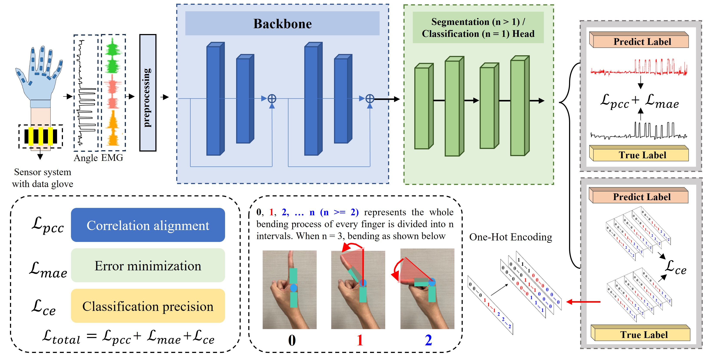

# FESNet: Fine-Grained Electromyography Segmentation Network

This repository contains the implementation of **FESNet**, a deep learning-based network specifically designed for the segmentation and classification of electromyography (EMG) signals. FESNet allows fine-grained analysis of finger movements and enables the transition from classification to segmentation tasks through varying time-window granularities.

This figure illustrates the complete process of our approach. In the feature extraction phase, we utilize the backbone network to extract both inter-channel and intra-channel features, the functional head then integrates these final features to generate predictions tailored to the specific task type. Additionally, w determines the granularity of either segmentation or classification, by adjusting the parameter n, the model can also control the precision of movement differentiation, ultimately determining the number of distinct classes.

## Features
- **Fine-Grained Segmentation**: FESNet is the first known model to segment EMG signals based on predefined angle states and different time granularities \(w\).
- **Deep Learning Architecture**: The network employs a robust backbone with inter-intra channel extraction and multi-head self-attention mechanisms for both local and global feature extraction.
- **Flexible Task Adaptation**: FESNet is designed to handle both classification and segmentation tasks by adapting the functional head based on the granularity required.
- **Custom Loss Function**: Incorporates a composite loss function combining Mean Absolute Error (MAE), Pearson Correlation Coefficient (PCC), and Cross-Entropy (CE) for efficient optimization during training.

## Dataset
The network is validated using the **Ninapro DB8** dataset, which includes electromyographic signals from both able-bodied subjects and forearm amputees. This dataset allows comprehensive testing across a wide variety of hand movements.
